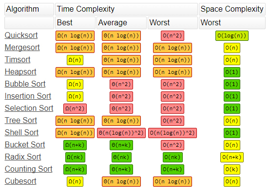

# algorithms-ds-coursework
Coursework and hw codes for Tim Roughgarden's Algorithms &amp; DS class (4-part specialization). Slides for C1 & C2, C3 & C4 are uploaded. Alg code for C1 & C2 are complete, C3 is partial. 

